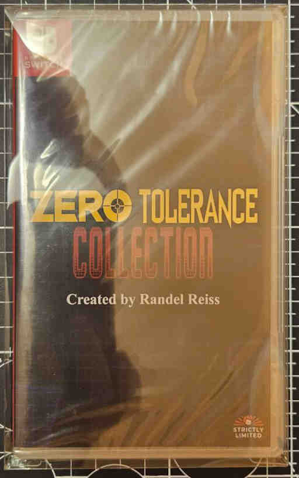

### A
| Status | The names of the games                     |Condition|         Serial number         |                           Covers                            |
|:------:|:-------------------------------------------|:-------:|:-----------------------------:|:-----------------------------------------------------------:|
|  [+]   | AD&D Baldur's Gate: EE                     | Sealed  | NONE                          |                     |
|  [+]   | AD&D Icewind Dale & Planescape Torment: EE | Sealed  | HAC-P-ARSGA TSA-HAC-ARSFA-UKV |  |
|  [+]   | AD&D Nweverwinter Nights: EE               | Sealed  | NONE                          |                          |
|  [ ]   | AD&D Pillars of Eternity                   |         |                               |                                                             |
|  [+]   | Another world / Flashback                  | Sealed  | HAC-P-AU8WA HAC-AU8WA-EUR     |      |
|  [+]   | Axiom Verge                                | Sealed  | HAC-P-AEJQB TSA-HAC-AEJQB-UXP |  |
|  [+]   | Axiom Verge 2                              | Sealed  | HAC-P-AWGQA LR123CVR          |           |

### B
| Status | The names of the games                     | Condition | Serial number                 | Covers                                                      |
|:------:|:-------------------------------------------|:---------:|:-----------------------------:|:-----------------------------------------------------------:|
|  [ ]   | Bayonetta                                  |           |                               |                                                             |
|  [ ]   | Bayonetta 2                                |           |                               |                                                             |
|  [ ]   | Bayonetta 3                                |           |                               |                                                             |
|  [+]   | Bloodstained: Curse of The Moon Chronicles | Sealed    | HAC-P-BCDPA TSA-HAC-BCDPA-JPN |  |
|  [+]   | Bloodstained: Ritual of The Night          | Sealed    | HAC-P-AB4PA TSA-HAC-AB4PA-UKV |  |
|  [ ]   | Borderlands: LC                            |           |                               |                                                             |

### C
| Status | The names of the games        | Condition | Serial number                 | Covers                                                      |  
|:------:|:------------------------------|:---------:|:-----------------------------:|:-----------------------------------------------------------:|
|  [ ]   | Capcom Belt Action Collection |           |                               |                                                             |
|  [+]   | Castlevania: AC               | Sealed    | HAC-P-ATA9B LR106CVR          |           |
|  [+]   | Commandos 2: HD Remaster      | Sealed    | HAC-P-AXNYA TSA-HAC-AXNYA-UXP |  |
|  [ ]   | Contra AC                     |           |                               |                                                             |
|  [+]   | Contra: Rogue Corps           | Sealed    | HAC-P-ATCFA 27104-CS          |           |
|  [ ]   | Cuphead                       |           |                               |                                                             |
|  [ ]   | Cyber Shadow                  | Sealed    | Super Rare 128                |                 |

### D
| Status | The names of the games                    | Condition |         Serial number         |                           Covers                            |
|:------:|:------------------------------------------|:---------:|:-----------------------------:|:-----------------------------------------------------------:|
|  [ ]   | DAEMON X MACHINA                          |           |                               |                                                             |
|  [+]   | Darksiders: Genesis                       |  Sealed   | HAC-P-ATYHA TSA-HAC-ATYHA-EUR |  |
|  [+]   | Darksiders: Warmastered Edition           |  Sealde   | HAC-P-ASFSA TSA-HAC-ASFSA-EUR |  |
|  [+]   | Darksiders II: Deathinitive Edition       |  Sealed   | HAC-P-ATGPA TSA-HAC-ATGPA-EUR |  |
|  [+]   | Darksiders III                            |  Sealed   | HAC-P-A3C8A TSA-HAC-A3C8A-EUR |  |
|  [+]   | Doom 1,2,3 cover-1                        |  Sealed   | HAC-P-A4KYA LR102CVR          |           |
|  [+]   | Doom 1,2,3 cover-2                        |  Sealed   | HAC-P-A4KYA LR102CVR          |         |
|  [+]   | Doom 1,2,3 BigBox                         |  Sealed   | HAC-P-A4KYA LR102CVR          |         |
|  [+]   | Doom64                                    |  Sealed   | HAC-P-UMA LR081CVR            |             |
|  [+]   | Doom 2016                                 |  Sealed   | HAC-P-AF3BA-USZ 107281A       |        |
|  [+]   | Doom Eternal                              |  Sealed   | HAC-P-A6SVA LR154CVR          |           |
|  [ ]   | Doom 1+ Doom 2                            |           |                               |                                                             |
|  [ ]   | Double Dragon Gaiden: Rise of the Dragons |           |                               |                                                             |
|  [+]   | Disney Classic Games Collection           |  Sealed   | HAC-P-AVEPD 3016363           |            |
|  [+]   | Dusk                                      |  Sealed   | HAC-P-A76WA LR118CVR          |           |
|  [+]   | Diablo 3                                  |  Sealed   | HAC-P-AQ3FA TSA-HAC-AQ3FA-UKV |  |

### F
| Status | The names of the games | Condition | Serial number                 | Covers                                                      |    
|:------:|:-----------------------|:---------:|:-----------------------------:|:-----------------------------------------------------------:|
|  [+]   | Felix The Cat		  | Sealed    | HAC-P-BFESA LRS203            |             |
|  [+]   | Flashback              | Sealed    | HAC-P-AFD5A TSA-HAC-AFD5A-EUR |  |
|  [ ]   | Flashback 2            |           |                               |                                                             |
|  [+]   | Front Mission 1ST: LME | Sealed    | HAC-P-A7UQA HAC-A7UQA-EUR     |      |
|  [+]   | Front Mission 2        | Sealed    |	HAC-P-A9CQA TSA-HAC-A9CQA-EUR |  |
|  [ ]   | Front Mission 3        |           |	                              |                                                             |

### G
| Status | The names of the games         | Condition | Serial number                 | Covers                                                      |
|:------:|:-------------------------------|:---------:|:-----------------------------:|:-----------------------------------------------------------:|
|  [+]   | Gleylancer & Gynoug Combo Pack | Sealed    | HAC-P-BEQMA LRS227            |             |
|  [+]   | Gothic I, II                   | Sealed    | HAC-P-BG9HA TSA-HAC-BG9HA-EUR |  |

### H
| Status | The names of the games | Condition | Serial number                 | Covers                                    |
|:------:|:-----------------------|:---------:|:-----------------------------:|:-----------------------------------------:|
|   [+]  | Huntdown               | Sealed    | HAC-P-AGFLA                   |  |

### I
| Status | The names of the games | Condition | Serial number                 | Covers                                                      |
|:------:|:-----------------------|:---------:|:-----------------------------:|:-----------------------------------------------------------:|
|  [ ]   | Into the Breach        |           |                               |                                                             |
|  [+]   | Ion Fury               |           | HAC-P-ASTTA TSA-HAC-ASTTA-UKV |  |

### J
| Status | The names of the games                 | Condition | Serial number         | Covers                                              |
|:------:|:---------------------------------------|:---------:|:---------------------:|:---------------------------------------------------:|
|  [+]   | Jurassic Park Classic Games Collection | Sealed    | HAC-P-BDU6A NSW-JURPK |  |

### K
| Status | The names of the games              | Condition | Serial number                | Covers                                                     |
|:------:|:------------------------------------|:---------:|:----------------------------:|:----------------------------------------------------------:|
|  [ ]   | Kirby and the Forgotten Land        |           |                              |                                                            |
|  [ ]   | Kirby Star Allies                   |           |                              |                                                            |
|  [+]   | Kirby's Return to Dream Land Deluxe | Sealed    | HAC-P-A2JA TRA-HAC-A2JYA-UKV |  |

### L
| Status | The names of the games                       | Condition | Serial number                     | Covers                                                          |
|:------:|:---------------------------------------------|:---------:|:---------------------------------:|:---------------------------------------------------------------:|
|  [+]   | Legacy of Kain: Soul Reaver 1 & 2 Remastered | Sealed    | HAC-P-BELFA TSA-HAC-BELFA-UXP     |      |
|  [+]   | Little Nightmares 1 CE                       | Sealed    | HAC-P-AEB8A TSA-HAC-AEB8A-UKV     |      |
|  [+]   | Little Nightmares 2 DO                       | Sealed    | HAC-P-AU56A TSA-HAC-AU56A-UKV     |      |
|  [ ]   | Little Nightmares 3                          |           |                                   |                                                                 |
|  [+]   | Lollipop Chainsaw RePOP                      | Sealed    | HAC-P-BBRCA TRA-HAC-BBRCA-JPN     |      |
|  [+]   | Luigi's Mansion 2                            | Sealed    | HAC-P-BANRA-UAE TRA-HAC-BANRA-UAE |  |
|  [+]   | Luigi's Mansion 3                            | Sealed    | HAC-P-AG3JA TRA-HAC-AG3JA-UKV     |      |

### M
| Status | The names of the games                     | Condition | Serial number                 | Covers                                                      |
|:------:|:-------------------------------------------|:---------:|:-----------------------------:|:-----------------------------------------------------------:|
|  [+]   | Mega Man 11                                | Sealed    | HAC-P-ALGCA 41006E            |             |
|  [+]   | Mega Man Battle Network Legacy Collection  | Sealed    | HAC-P-A8H2A 41030E            |             |
|  [+]   | Mega Man Legacy Collection 1+2             | Sealed    | HAC-P-AKRVA 41002E            |             |
|  [+]   | Mega Man X Legacy Collection 1+2           | Sealed    | HAC-P-ALGGA 41004E            |             |
|  [+]   | Mega Man Zero/ZX Legacy Collection         | Sealed    | HAC-P-AS4UA 41018E            |             |
|  [+]   | Metroid Dread                              | Sealed    | HAC-P-AYL8A TRA-HAC-AYL8A-ITA |  |
|  [ ]   | Metroid Prime 4                            |           |                	              |                                                             |
|  [+]   | Metroid Prime Remastered                   | Sealed    | HAC-P-A3SDA TRA-HAC-A3SDA-UKV |  |
|  [ ]   | Metal Gear Solid: Master Collection Vol. 1 |           |                               |

### N
| Status | The names of the games                     | Condition | Serial number                 | Covers                                                      |
|:------:|:-------------------------------------------|:---------:|:-----------------------------:|:-----------------------------------------------------------:|
|  [+]   | NEOGEO Selection Vol.1                     | Sealed    | HAC-P-BK44A TRA-HAC-BK44A-JPN |  |
|  [+]   | NEOGEO Selection Vol.2                     | Sealed    | HAC-P-BK45A TRA-HAC-BK45A-JPN |  |
|  [+]   | NEOGEO Selection Vol.3                     | Sealed    | HAC-P-BMRHA TRA-HAC-BMRHA-JPN |  |
|  [+]   | NEOGEO Selection Vol.4                     | Sealed    | HAC-P-BMRJA TRA-HAC-BMRJA-JPN |  |
|  [ ]   | NEOGEO Selection Vol.5                     |           |                               |                                                             |
|  [ ]   | NEOGEO Selection Vol.6                     |           |                               |                                                             |
|  [ ]   | NEOGEO Selection Vol.7                     |           |                               |                                                             |
|  [ ]   | NEOGEO Selection Vol.8                     |           |                               |                                                             |
|  [ ]   | NEOGEO Selection Vol.9                     |           |                               |                                                             |
|  [ ]   | NEOGEO Selection Vol.10                    |           |                               |                                                             |
|  [+]   | Ninja Gaiden: Ragebound                    | Sealed    | HAC-P-BLC6A TSA-HAC-BLC6A-EUR |  |

### O
| Status | The names of the games  | Condition |         Serial number         |                           Covers                            |
|:------:|:------------------------|:---------:|:-----------------------------:|:-----------------------------------------------------------:|
|  [x]   | Operation Wolf: Returns | Sealed    | HAC-P-A7NVA TSA-HAC-A7NVA-EUR |  |
|  [ ]   | Ori: The Collection     |           |                               |                                                             |

### P
| Status | The names of the games | Condition |         Serial number         |                           Covers                            |
|:------:|:-----------------------|:---------:|:-----------------------------:|:-----------------------------------------------------------:|
|  [+]   | Postal: REDUX          | Sealed    | HAC-P-AX4TA LRPOCVR           |            |
|  [+]   | Prodeus                | Sealed    | HAC-P-A7SJA TSA-HAC-A7SJA-UKV |  |

### Q
 Status | The names of the games | Condition | Serial number        | Covers                                             |
:------:|:-----------------------|:---------:|:--------------------:|:--------------------------------------------------:|
 [+]    | Quake                  | Sealed    | HAC-P-AZPQA LR119CVR |  |
 [+]    | Quake II               | Sealed    | HAC-P-BADFA LRS207   |    |

### R
 Status | The names of the games              | Condition | Serial number        | Covers                                           |
:------:|:------------------------------------|:---------:|:--------------------:|:------------------------------------------------:|
 [+]    | Rocket Knight Adventures ReSparked! | Sealed    | HAC-P-BAXWA LRS209   |  |

### S
| Status | The names of the games                     | Condition |           Serial number            |                             Covers                              |
|:------:| :----------------------------------------- |:---------:|:----------------------------------:|:---------------------------------------------------------------:|
|  [+]   | Scott Pilegrim  vs. The World: The Game CE | Sealed    | HAC-P-AX4WA LR094CVR               |               |
|  [ ]   | SEGA Genesis Classics                      |           |                                    |                                                                 |
|  [ ]   | SEGA Mega Drive Classics                   |           |                                    |                                                                 |
|  [+]   | Shotgun King                               | Sealed    | HAC-P-A9WYA TSA-HAC-A9WYA-EUR      |      |
|  [+]   | Showel Knight                              | Sealed    | HAC-P-AB7PA TSA-HAC-AB7PA-UKV      |      |
|  [+]   | Signalis                                   | Sealed    | HAC-P-A896A TSA-HAC-A896A-UKV      |      |
|  [+]   | SNK 40th Anniversary Collection            | Sealed    | HAC-P-AP3TA TSA-HAC-AP3TA-UKV      |      |
|  [+]   | S.T.A.L.K.E.R.: Legends of Zone            | Sealed    | HAC-P-BMJJA(JPN) TSA-HAC-BMJJA-JPN |  |
|  [ ]   | Star Wars: Racer and Commando Combo        |           |                                    |                                                                 |
|  [ ]   | Star Wars: Jedi Knight Collection          |           |                                    |                                                                 |
|  [ ]   | Star Wars: Republic Commando               |           |                                    |                                                                 |
|  [+]   | Super Meat Boy                             | Sealed    | HAC-P-AHNXA LR028CVR               |               |
|  [ ]   | Syberia                                    |           |                                    |                                                                 |
|  [+]   | Syberia 2                                  | Sealed    | HAC-P-AD78A TSA-HAC-AD78A-EUZ      |      |
|  [+]   | Syberia 3                                  | Sealed    | HAC-P-AFLPA TSA-HAC-AFLPA-EUR      |      |
     
### T
| Status | The names of the games                                 | Condition |           Serial number            |                             Covers                              |
|:------:|:-------------------------------------------------------|:---------:| :--------------------------------: | :--------------------------------------------------------------:|
|  [+]   | Tetris 99                                              | Sealed    | HAC-R-ARZNB TRA-HAC-ARZNB-RURU     |     |
|  [+]   | Teenage Mutant Ninja Turtles: The Cowabunga Collection | Sealed    | HAC-P-A42SA TSA-HAC-A42SA-UXP      |      |
|  [+]   | Teenage Mutant Ninja Turtles: Shredder's Revenge       | Sealed    | HAC-P-A3UVA TSA-HAC-A3UVA-EUR      |      |
|  [+]   | Teenage Mutant Ninja Turtles: Shredder's Revenge UE    | Sealed    | HAC-P-A3UVM TSA-HAC-A3UVM-EUR      |      |
|  [+]   | Teenage Mutant Ninja Turtles: Warth of the Mutants     | Sealed    | HAC-P-BEV4A TSA-HAC-BEV4A-EUR      |      |
|  [+]   | Teenage Mutant Ninja Turtles: Mutants Unleashed        | Sealed    | HAC-P-BDQAA TSA-HAC-BDQAA-UXP      |      |
|  [+]   | The Legend of Zelda: Breath of the Wild                | Sealed    | HAC-P-AAAAA TRA-HAC-AAAAA-UKV      |      |
|  [+]   | The Legend of Zelda: Echoes of Wisdom                  | Sealed    | HAC-P-BDGEA TRA-HAC-BDGEA-UKV      |      |
|  [+]   | The Legend of Zelda: Link's Awakening                  | Sealed    | HAC-P-AR3NA TRA-HAC-AR3NA-UKV      |      |
|  [+]   | The Legend of Zelda: Link's Awakening                  | Sealed    | HAC-P-AR3NA TRA-HAC-AR3NA-CHT      |      |
|  [+]   | The Legend of Zelda: Skyward Sword HD                  | Sealed    | HAC-P-AZ89A TRA-HAC-AZ89A-RURU     |     |
|  [+]   | The Legend of Zelda: Skyward Sword HD                  | Sealed    | HAC-P-AZ89A TRA-HAC-AZ89A-CHT      |      |
|  [+]   | The Legend of Zelda: Tears of the Kingdom              | Sealed    | HAC-P-AXN7A TRA-HAC-AXN7A-UKV      |      |
|  [+]   | The Messenger                                          | Sealed    | HAC-P-AQ7PE DD67321C               |               |
|  [+]   | Toaplan Arcade Garage: KYUKYOKU TIGER-HELO             | Sealed    | HAC-P-BDL3A LRS217                 |                 |
|  [+]   | Tomb Raider I-II-III Remastered                        | Sealed    | HAC-P-BDHRA TSA-HAC-BDHRA-UKV      |      |
|  [ ]   | Tomb Raider IV-VI-VII Remastered                       |           |                                    |                                                                 |
|  [+]   | Trigger Witch                                          | Sealed    | HAC-P-A3KYA(ASI) TRA-HAC-A3KYA-ASI |  |
|  [ ]   | Turok: Dinosaur Hunter                                 |           |                                    |                                                                 |
|  [ ]   | Turok 2: Seeds of Evil                                 |           |                                    |                                                                 |
|  [ ]   | Turok 3: Shadow of Oblivion                            |           |                                    |                                                                 |

### X
 Status | The names of the games                                 | Condition | Serial number                  | Covers                                            |
:------:|:-------------------------------------------------------|:---------:|:------------------------------:|:-------------------------------------------------:|
 [+]    | Xeodrifter	                     					 | Sealed    | HAC-P-AMQJA LRXDCVR            |  |

### Z
| Status | The names of the games                                | Condition | Serial number                  | Covers                                                      |
|:------:|:------------------------------------------------------|:---------:|:------------------------------:|:-----------------------------------------------------------:|
| [+]    | Zero Tolerance: Collection                            | Sealed    | HAC-P-A7ZJA TSA-HAC-A7ZJA-UXP  |  |
