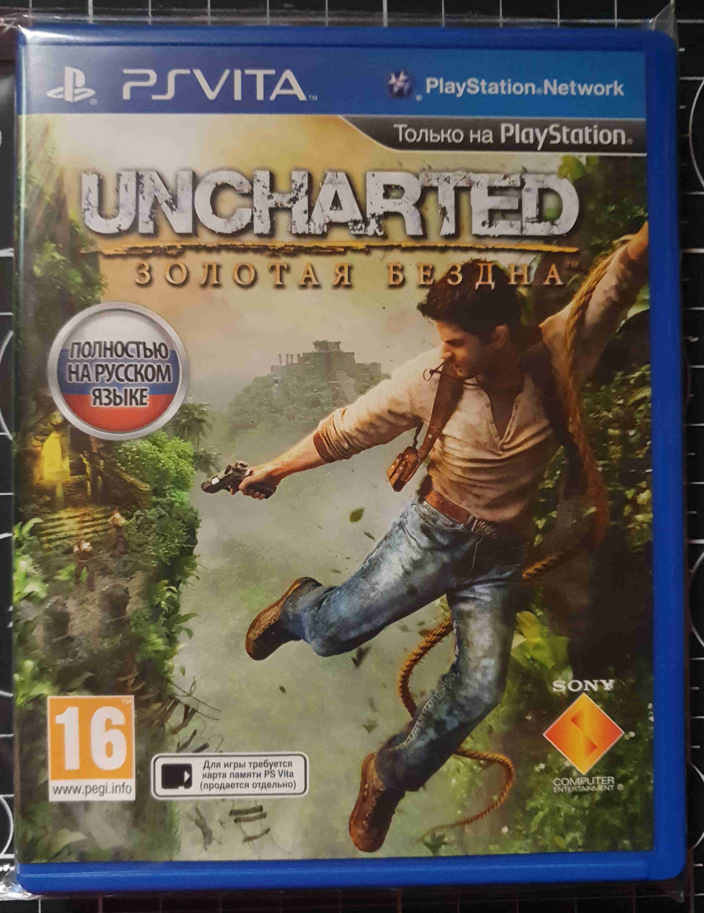

### A
 Status | The names of the games | Region | Condition      | Serial number  | Covers 
:------:|:-----------------------|:------:|:--------------:|:--------------:|:-------:
 [+]    | Batman Blackgate       |        | Cartridge only |                |         

### D
 Status | The names of the games | Region | Condition      | Serial number  | Covers 
:------:|:-----------------------|:------:|:--------------:|:--------------:|:-------:
 [+]    | Dungeon Hunter         |        | Cartridge only |                |

### G
 Status | The names of the games | Region | Condition      | Serial number  | Covers 
:------:|:-----------------------|:------:|:--------------:|:--------------:|:-------:
 [ ]    | God of War Collection  |        |                |                |
 [ ]    | Gravity Rush           |        |                |                |

### J
 Status | The names of the games | Region | Condition      | Serial number  | Covers 
:------:|:-----------------------|:------:|:--------------:|:--------------:|:-------:
 [ ]    | Jak & Daxter           |        |                |                |

### K
 Status | The names of the games | Region | Condition      | Serial number  | Covers 
:------:|:-----------------------|:------:|:--------------:|:--------------:|:-------:
 [+]    | Killzone: Наемник      |        |                | PCSF 00403     | 

### I
 Status | The names of the games       | Region | Condition  | Serial number  | Covers 
:------:|:-----------------------------|:------:|:----------:|:--------------:|:-------:
 [ ]    | Injustice: Gods Among Us. UE |        |            |                |

### L
 Status | The names of the games                    | Region | Condition  | Serial number  | Covers 
:------:|:------------------------------------------|:------:|:----------:|:--------------:|:-------:
 [ ]    | LittleBigPlanet                           |        |            |                |
 [+]    | LittleBigPlanet Marvel Super Hero Edition |        |            | PCSF 00516     | 

### M
 Status | The names of the games | Region | Condition  | Serial number  | Covers 
:------:|:-----------------------|:------:|:----------:|:--------------:|:-------:
 [+]    | Mortal Kombat (2011)   |        |            | PCSB 00106     | 
 [ ]    | MotorStorm: RC         |        |            |                |    

### R
 Status | The names of the games   | Region | Condition  | Serial number  | Covers 
:------:|:-------------------------|:------:|:----------:|:--------------:|:-------:
 [ ]    | Rayman Legends           |        |            |                |
 [ ]    | Rayman Origins           |        |            |                |
 [ ]    | Resistance Burning Skies |        |            |                |

### S
 Status | The names of the games        | Region | Condition  | Serial number  | Covers 
:------:|:------------------------------|:------:|:----------:|:--------------:|:-------:
 [ ]    | Silent Hill: Book of Memories |        |            |                | 
 [ ]    | Sly Cooper: Прыжок во времени |        |            |                |

### T
 Status | The names of the games | Region | Condition      | Serial number  | Covers 
:------:|:-----------------------|:------:|:--------------:|:--------------:|:-------:
 [+]    |Tetris                  |        |                | PCSB 00642     | 

### U
 Status | The names of the games    | Region | Condition  | Serial number  | Covers 
:------:|:--------------------------|:------:|:----------:|:--------------:|:-------:
 [ ]    | Unit 13                   |        |            |                |
 [x]    | Uncharted: Золотая Бездна |        |            | PCSF 0001      | 

### W
 Status | The names of the games | Region | Condition  | Serial number  | Covers 
:------:|:-----------------------|:------:|:----------:|:--------------:|:-------:
 [ ]    | WipeOut 2048           |        |            |                |      
